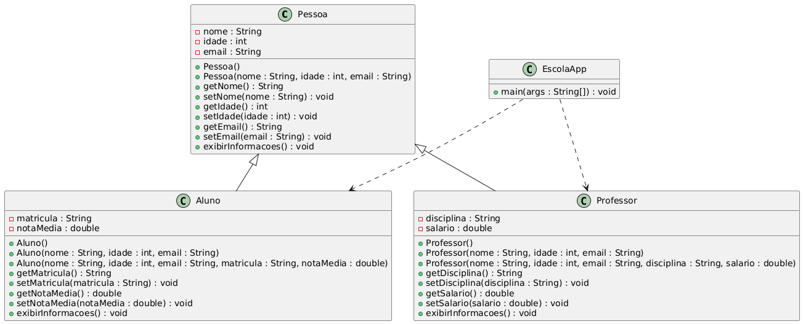

# Mini Projeto POO - Aulas 01–04

## Sistema Escolar (Exercício 3)

**Aluno:** Jessica Batista - 03354437
**Turma:** ADS Noite 2 periodo - SPL0400201NNA

Este projeto é um mini-sistema escolar desenvolvido em Java para praticar:

- Criação e uso de objetos
- Encapsulamento (getters e setters)
- Construtores e sobrecarga
- Herança e polimorfismo
- Sobrescrita de métodos
- Exibição de dados no console com `System.out.println()`

## Diagrama de Classes

